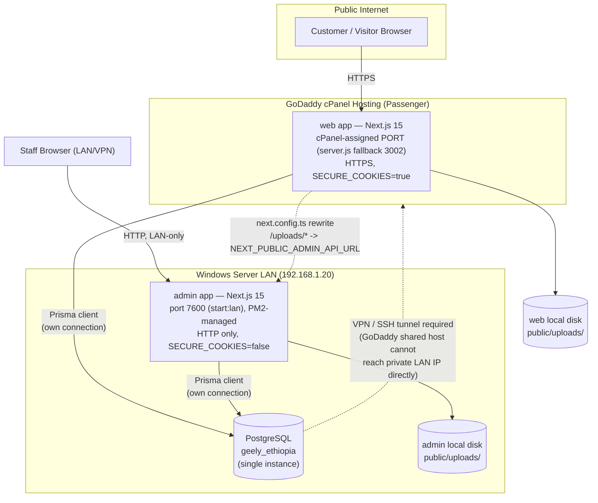
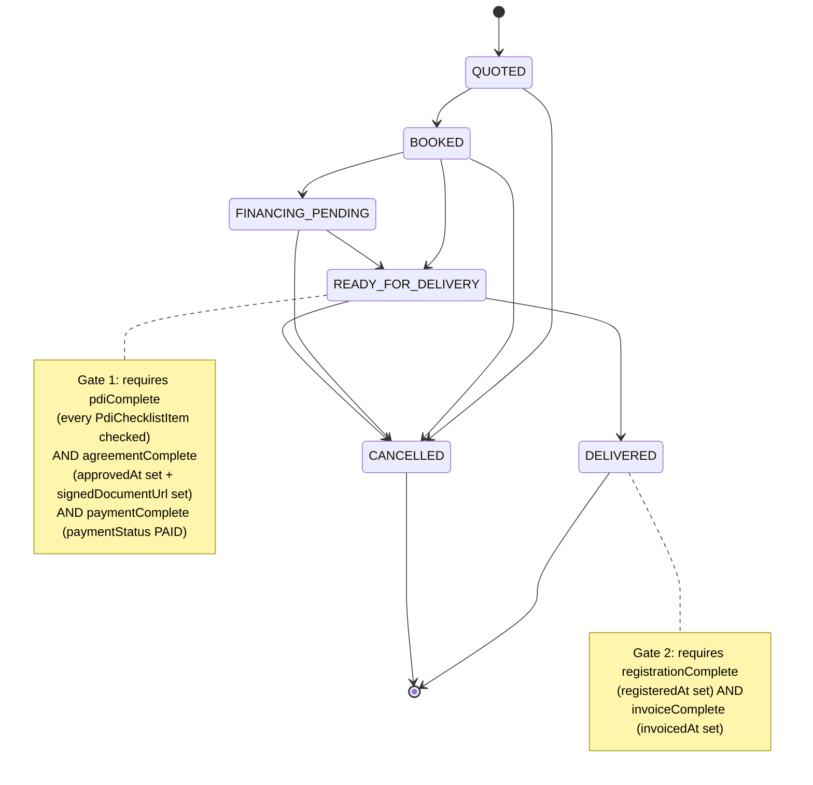
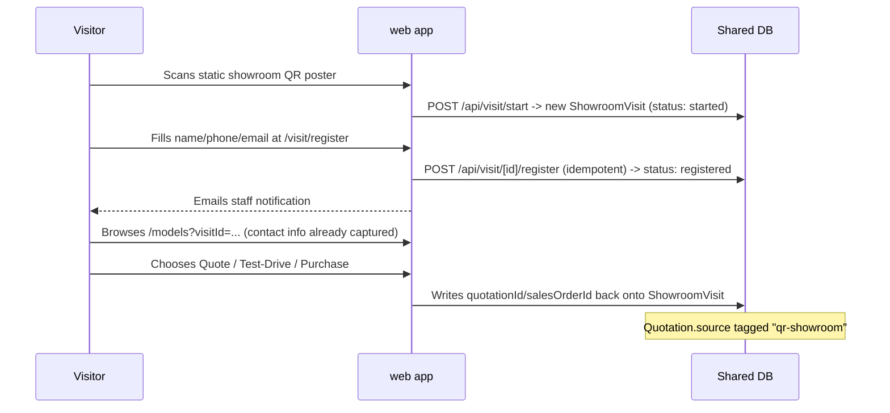
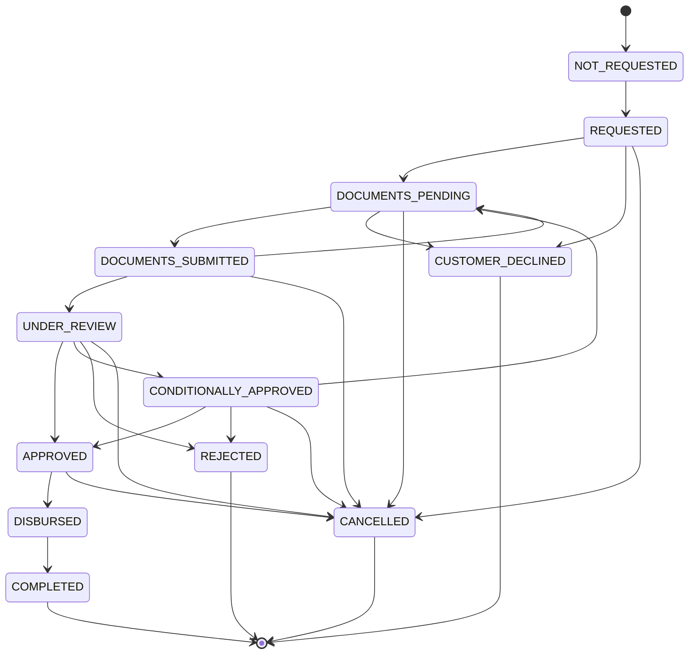
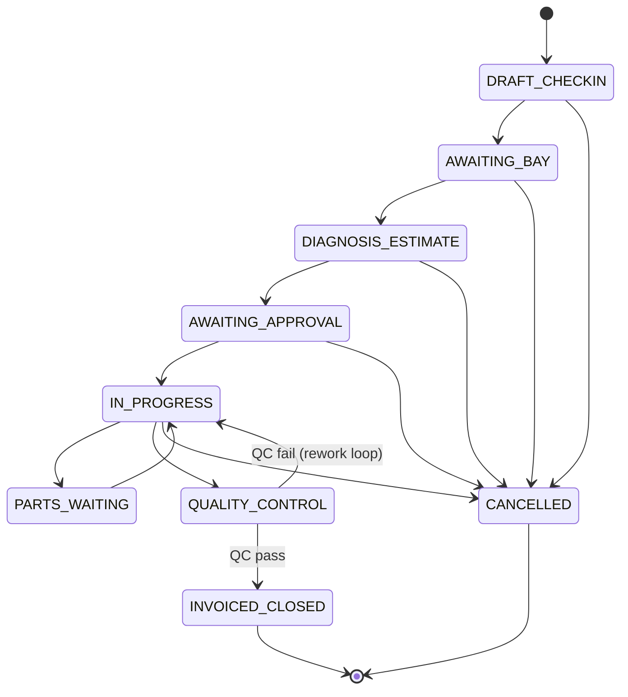
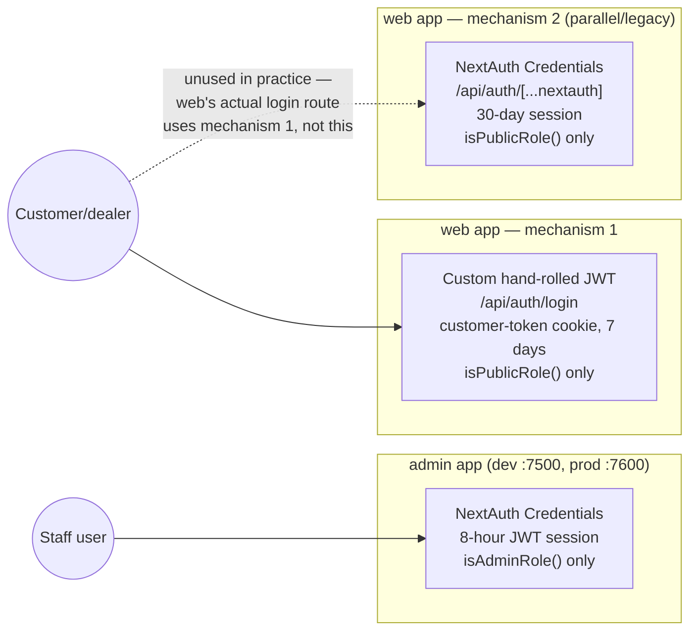
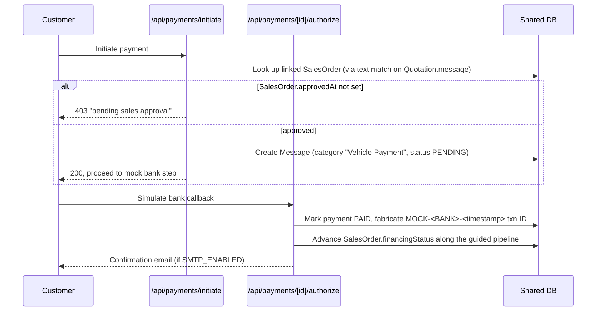

# Kerchanshe Geely Ethiopia — System Analysis

*A comprehensive technical and business analysis of the platform: architecture, tech stack, data model, business workflows, approval cycles, and data flow.*

---

## 1. Executive Summary

Kerchanshe Geely Ethiopia is an automotive dealership and workshop management platform built as **two independent Next.js applications sharing one PostgreSQL database**:

- **`web`** — the public-facing marketing/e-commerce site (vehicle catalog, configurator, financing/purchase flow, showroom QR walk-in, service check-in kiosk, customer accounts). Deployed on GoDaddy shared/cPanel hosting.
- **`admin`** — the internal back-office system (sales pipeline, workshop/service management, CMS content authoring, user/role administration, analytics). Deployed on a Windows Server LAN box via PM2, which also hosts the PostgreSQL instance.

There is **no separate backend/ERP service** — each app talks to the database directly through its own Prisma client, and business logic (order approval, workshop job-card state machines, commission calculation, etc.) lives in Next.js API routes in both apps, organized as a strict three-tier stack within each app (see §2.5). The single most important fact about this system: **it has no ERP and no live payment gateway**. Every "approval" is a manual staff action recorded as a timestamp/flag on a row, and payment is fully mocked pending a vendor decision (Chapa/Telebirr are named candidates, none integrated). This is by design and explicitly documented in the project's own backlog (`docs/SWMS-INTEGRATION-BACKLOG.md`): *"No ERP exists in this codebase — this repo is the operational system."*

The two apps are coupled by convention rather than infrastructure: they must share byte-identical auth secrets, a mirrored Prisma schema (synced one-directionally from `admin` to `web` via a script), and the same physical database — but they do **not** share a session, an uploads directory, or (in almost all cases) an API. Each app re-implements the logic it needs directly against the shared tables.

---

## 2. System Architecture

### 2.1 Tier diagram



**Key architectural facts:**

- No monorepo tooling (no workspaces, no Turborepo/Lerna/pnpm-workspace). `admin/` and `web/` are two fully independent `package.json`/`node_modules`/Next.js projects.
- No Docker, no Vercel — traditional long-running Node process hosting (PM2 on Windows for `admin`; Phusion Passenger via a custom `server.js` for `web` on cPanel).
- `admin` owns the PostgreSQL instance locally; `web`'s `DATABASE_URL` must reach it over VPN/SSH tunnel from GoDaddy's shared hosting — Postgres is never exposed to the public internet directly.
- Uploaded files are **not shared**: a file uploaded through `admin` lives only on the admin server's disk and is not reachable by `web`'s GoDaddy deployment except through the `/uploads/*` rewrite proxy in `web/next.config.ts`, which forwards image requests to admin's origin so they resolve same-origin without CORS.
- Both apps now support being served from a subpath (`NEXT_PUBLIC_BASE_PATH`, `lib/basePath.ts`, wired into `next.config.ts`/`layout.tsx`) for hosting setups where the app isn't mounted at the domain root.

### 2.2 Deployment topology

| | `admin` | `web` |
|---|---|---|
| Host | Windows Server, LAN IP `192.168.1.20` | GoDaddy shared/cPanel hosting, public domain |
| Dev port | 7500 (`npm run dev`) | 7501 (`npm run dev`) |
| Production port | 7600 (`npm run start` / `start:lan`, run under PM2) | cPanel-assigned via `process.env.PORT` (Passenger); `server.js` falls back to 3002 only if `PORT` is unset |
| Process manager | PM2 (`ecosystem.config.cjs` → `npm run start:lan`) | Phusion Passenger, custom `server.js` entry |
| TLS | None — HTTP only on LAN (`SECURE_COOKIES=false`) | HTTPS (`SECURE_COOKIES=true`) |
| Database | Hosts PostgreSQL locally | Connects to admin's DB via VPN/tunnel |
| Deployment package | `deploy/admin-deploy/` (via `scripts/package-deploy.ps1`, robocopy, excludes `node_modules`/`.next`/`.git`/`.env`) | `deploy/web-deploy/` (same script) |
| Deploy runbook | `docs/DEPLOY-ADMIN-LAN.md` | `docs/DEPLOY-WEB-GODADDY.md` |

**Critical coupling requirement:** `NEXTAUTH_SECRET` / `JWT_SECRET` must be **byte-for-byte identical** across both deployments — otherwise JWTs/sessions issued by one app would not validate against the shared `User` table logic the other app expects (in practice each app validates its own tokens, but the shared-secret convention is documented as required in both deploy docs).

### 2.3 Schema synchronization

`admin/prisma/schema.prisma` is the single source of truth (60 models). `web/prisma/schema.prisma` is a **byte-for-byte mirror**, kept in sync via `scripts/sync-web-prisma-schema.mjs` (a plain file copy) and `npm run sync:schema`. Convention: **edit the schema in `admin` only, then run the sync script** — never hand-edit `web`'s copy. Both apps share one `_prisma_migrations` history table in the same physical database. As of this analysis both copies carry the same 60 models and the same latest migration (`expand_financing_status`) — no drift.

### 2.4 CI/CD

- `.github/workflows/ci.yml` — on push/PR to main/master: (1) lint + typecheck both apps, (2) build both apps (dummy `DATABASE_URL` for `prisma generate`), (3) `npm audit --omit=dev --audit-level=critical` for both apps.
- `.github/workflows/lighthouse-ci.yml` — builds `web` and runs Lighthouse CI performance checks.
- **No CD/deploy automation** — deployment is a manual process using `scripts/package-deploy.ps1` and the two `docs/DEPLOY-*.md` runbooks.

### 2.5 The three-tier pattern inside each app

Both apps follow the same internal layering (a deliberate reorganization completed across this repo's git history — see the "Phase N" commits):

```
<app>/
  app/                       # FRONTEND — pages/layouts
    api/**/route.ts          # BACKEND — thin HTTP handlers: auth check → parse → one
                              #  repository/service call → shape the response. No prisma.*
                              #  calls are allowed here — enforced as a standing invariant,
                              #  checked with grep -rn "prisma\." app/api.
  components/ features/ hooks/ providers/
  services/                  # FRONTEND — typed API-client wrappers consumed by features/*
  repositories/               # DATABASE tier — every prisma.* call in the app lives here,
                              #  one file per domain/model cluster (29 files in admin, 28 in web)
  lib/
    prisma.ts                 # DATABASE tier — client singleton
    services/                 # BACKEND tier — business logic/orchestration, organized by
                              #  domain (sales, workshop, financing, quotations, ...)
    auth/ cors.ts env.ts rate-limit.ts upload-utils.ts status-email.ts ...
                               # cross-cutting infra, not business logic
  prisma/                      # DATABASE tier — schema + migrations
```

This means a route file such as `admin/app/api/admin/orders/[id]/status/route.ts` is only ever: check the session/permission, parse the request body, call one function in `admin/lib/services/sales/orderOpsService.ts`, and return its result as JSON. All the Prisma reads/writes for that action live in `admin/repositories/salesOrderRepository.ts`. The same shape repeats for every domain: sales orders, quotations, workshop job cards/warranty claims, parts, financing, CMS content, dealers, users, and so on.

**Two files' contents are deliberately frozen** and excluded from this reorganization because they are a cross-app contract: `admin/app/api/admin/orders/[id]/countersign/route.ts` and `.../handover-countersign/route.ts` make a server-to-server `fetch()` into `web`'s `.../countersign-stamp` endpoints — the URL, method, and body shape must stay byte-identical between the two apps.

---

## 3. Tech Stack

### 3.1 `admin` (`geely-ethiopia-admin`)

| Layer | Choice |
|---|---|
| Framework | Next.js 15.5.23 (App Router) |
| UI | React 19.0.0 / React DOM 19.0.0 |
| Language | TypeScript 5.7.2 |
| ORM / DB | Prisma ^5.22.0 + `@prisma/client`, PostgreSQL |
| Auth | NextAuth 4.24.15 (Credentials provider), `bcryptjs`, `jsonwebtoken` |
| Styling | Tailwind CSS 3.4.17 |
| State | Zustand, React Hook Form |
| PDF | `pdf-lib` (quotations, agreements, invoices, handovers — all with a shared dealer-letterhead treatment) |
| QR | `qrcode` (showroom self-registration poster generation) |
| Email | `nodemailer` ^9 |
| Icons | `lucide-react` |
| Lint | ESLint 9 (`next lint`; `eslint.ignoreDuringBuilds: true` — noted tech debt) |
| Process mgmt | PM2 (`ecosystem.config.cjs`, runs `npm run start:lan` → port 7600) |
| Dev port | 7500 |

### 3.2 `web` (`geely-ethiopia-web`)

Nearly identical dependency set to `admin` (Next 15.5.23, React 19, NextAuth 4.24.15, Prisma ^5.22.0, TypeScript 5.7.2, bcryptjs, jsonwebtoken, nodemailer, pdf-lib, react-hook-form, zustand), plus:

| Extra | Purpose |
|---|---|
| `framer-motion` | UI animation |
| Custom `server.js` | Phusion Passenger-compatible Node entry point, binds to `process.env.PORT` for cPanel hosting (falls back to 3002 if unset — not used by local dev/start) |
| `postinstall: prisma generate` | Ensures Prisma client is generated on deploy |

Dev port 7501. Security headers are notably more hardened in `web/next.config.ts` than admin's (full HSTS/CSP/X-Frame-Options/Referrer-Policy/COOP/Permissions-Policy set), since this is the public-internet-facing app.

### 3.3 Shared infrastructure

| | |
|---|---|
| Database | PostgreSQL, single instance, shared by both apps |
| Schema management | Prisma Migrate, single migration history, schema mirrored admin→web |
| Image hosting | Local disk (`public/uploads/`) per app — no S3/Cloudinary/Azure Blob |
| Email | `nodemailer` via SMTP, gated by `SMTP_ENABLED` env flag |
| CI | GitHub Actions (lint/typecheck/build/audit + Lighthouse) |
| Hosting | No containers — PM2 (admin, LAN) + cPanel Passenger (web, GoDaddy) |

---

## 4. Database & Domain Model

Single Prisma schema, 60 models, organized by domain:

**Auth**
- `User` — all accounts (staff and customer/dealer), disambiguated by a `role` string field
- `RolePermissionOverride` — per-role permission-flag overrides on top of hardcoded defaults

**Vehicle Catalog**
- `VehicleBrand`, `VehicleCategory`, `Vehicle` (core catalog item — pricing, stock, SEO), `VehicleColor`, `VehicleAccessory`, `VehicleInterior`, `VehicleWheel`, `VehiclePackage` (trim levels), `VehicleShowcase`

**Sales / CRM**
- `TestDrive`, `ShowroomVisit`, `Quotation` (lead capture, source-tagged, manager-approval fields), `SalesOrder` (order lifecycle, financing pipeline, PDI, registration/invoice/commission, agreement approve/sign/countersign/**reject**), `VehicleAllocation` (reserves a specific `Vehicle` unit against a `SalesOrder`, adjusting `Vehicle.stock`), `PdiChecklistItem`, `SalesOrderStatusHistory`, `Counter` (order numbering), `Dealer`

**Workshop / SWMS**
- `ServiceBooking`, `Technician`, `ServiceBay`, `JobCard` (core repair-order record), `JobCardStatusHistory`, `JobCardPart`, `WarrantyClaim`, `WarrantyClaimStatusHistory`, `Customer` (workshop identity, distinct from CRM), `CustomerVehicle` (VIN-level ownership), `CSISurveyResponse`

**Parts & Inventory**
- `SparePart`, `PartRequest`, `PartRequestItem`, `PartsPageContent`, `PartCategory`, `PartBrand`, `PartBenefit`

**CMS / Content**
- `Promotion`, `Review`, `NewsArticle`, `Message` (generic inbox/lead catch-all), `NewsletterSubscriber`, `Setting`, `HeroSection`, `MediaAsset`, `ElectricPage`/`ElectricSection`/`ElectricItem`/`ElectricMenuPage`, `ChargingStation`, `ServiceSection`/`ServiceItem`/`ServicePage`, `FAQ`, `SiteNavItem`, `Redirect`
  - *(The previously-orphaned `MegaMenuSection`/`MenuCategory`/`MenuItem` models — API existed, no admin UI, nothing rendered from them — have been removed via migration.)*

**Financing**
- `FinancingBank`, `FinancingProgram` (catalog data, not loan applications — see §5.4)

**Integration**
- `CRMSyncLog` (external CRM sync attempt log — no active external CRM found wired to it)

---

## 5. Business Logic & Workflows

### 5.1 Sales / Order Pipeline

**Core model chain:** `Quotation` → `SalesOrder` (1:1 via unique `quotationId`) → `PdiChecklistItem[]` + `SalesOrderStatusHistory[]` (+ optional `VehicleAllocation`).

**Status enum:** `QUOTED → BOOKED → FINANCING_PENDING → READY_FOR_DELIVERY → DELIVERED`, with `CANCELLED` reachable from any non-terminal state.

The legal transitions are enforced **server-side** (not just disabled UI buttons) by a state machine (`admin/lib/services/sales/orderStateMachine.ts`), checked in `admin/app/api/admin/orders/[id]/status/route.ts` → `admin/lib/services/sales/orderOpsService.ts`'s `transitionOrderStatus`:



Reaching `DELIVERED` triggers a side effect in the same transaction: `deliveredAt` is stamped, and if a `salesAgentId` is on file, `commissionAmount = totalPrice * commissionRate / 100` is computed and `commissionStatus` is set to `EARNED`.

**Two entry paths into the pipeline:**

1. **Quote-first** — customer submits `/quote` → creates a `Quotation` (`new → contacted → in_progress → converted/closed`, plus a manager-approval sub-state on top). A sales agent converts it to an order (`admin/app/api/admin/quotations/[id]/convert-to-order/route.ts`), which creates a `SalesOrder` at `BOOKED`, seeds the PDI checklist from a template, and sets `financingStatus: PENDING`-equivalent (`NOT_REQUESTED`/`REQUESTED`, see §5.4) if the quote flagged financing interest.
2. **Direct purchase** — customer fills the purchase form at `web/app/financing/apply/page.tsx` (vehicle, national ID, address, bank), posting to `web/app/api/public/purchases/route.ts`. This creates a `Message` record (category "Vehicle Purchase" — there is no dedicated `Purchase` model), then `linkPurchaseToSalesPipeline()` finds-or-creates a matching `Quotation` and `SalesOrder` so the direct purchase lands in the same admin pipeline as a converted quote. **The correlation key is a string** embedded in `Quotation.message` ("Purchase reference: GEO-...") — there is no foreign key tying the `Message`/purchase record to the `Quotation`/`SalesOrder`.

### 5.2 Showroom QR Walk-In Flow

**Model:** `ShowroomVisit` (`status`: `started → registered → sales|test-drive|purchase`), loosely linked (no FK) to `quotationId`/`salesOrderId`/`testDriveId`.



The QR code itself is static and stateless — every scan hits `/api/visit/start`, which mints a fresh `ShowroomVisit` row server-side. The `visitId` query param threads through the whole browsing session so the visitor never re-enters contact info. Admin visibility is a funnel view (`admin/components/admin/showroom-visits/ShowroomVisitsList.tsx`): Total → Registered → Quoted → Test Drives → Purchases, each visit linking to whatever record it produced.

### 5.3 Sales Agreement E-Sign, Countersign & Rejection Chain

This is the central approval cycle tying the whole pipeline together:

```mermaid
sequenceDiagram
    participant Agent as Sales Agent
    participant API as admin API
    participant Cust as Customer
    participant Mgr as Manager
    participant Pay as Payment API

    Agent->>API: POST /orders/[id]/approve (requires canManageQuotations)
    Note over API: One-way — 409 if approvedAt already set
    API->>API: Stamp approvedAt/approvedById
    API->>API: Generate PDF agreement (pdf-lib), not stored until signed
    API-->>Cust: Email with link to /agreement/[orderId]
    Cust->>Cust: Draws signature (canvas) OR uploads signed photo
    Cust->>API: POST /agreement/[orderId]/sign
    Note over API: One-way — 409 if signedDocumentUrl already set.\nGated on approvedAt being set (409 otherwise)
    API->>API: Stamp signedDocumentUrl (agreementComplete = true)
    alt Manager countersigns
        Mgr->>API: POST /orders/[id]/countersign (requires canCountersignAgreements)
        API->>API: Stamp countersignedAt/By, email customer a payment link
        API->>API: fetch web's /api/agreement/[id]/countersign-stamp\n(best-effort, cross-app, frozen contract)
    else Manager rejects ("Return for Correction")
        Mgr->>API: POST /orders/[id]/reject-agreement { reason }
        Note over API: Same precondition as countersign (must be signed,\nnot yet countersigned) — requires a reason
        API->>API: Stamp rejectedAt/By/reason; signedDocumentUrl stays\nuntil the agent attaches a fresh signed copy, which\nimplicitly clears the rejection
    end
    Cust->>Pay: POST /api/payments/initiate
    Note over Pay: Independently re-checks approvedAt (not signedDocumentUrl)\n403 "pending sales approval" if not set
    Pay-->>Cust: Payment allowed (mock gateway, see §7.3)
```

Staff can alternatively attach a signed scan directly via `OrderApprovalPanel.tsx` (`PATCH .../orders/[id]` with `signedDocumentUrl`), reusing the generic upload endpoint. Approval authority (`canManageQuotations`) and countersign/reject authority (`canCountersignAgreements`) are separate permission flags — there is **no manager-over-agent hierarchy enforced beyond that split**; whoever holds the relevant flag can act.

### 5.4 Financing

**There is still no automated loan underwriting** — a schema comment states this explicitly: *"the system records financing status; it does not underwrite financing."* What changed is that the status itself is no longer a free-form dropdown: `SalesOrder.financingStatus` is now a real, server-enforced guided pipeline (`admin/lib/services/sales/orderStateMachine.ts`'s `assertFinancingTransitionAllowed`, exposed via `PATCH /api/admin/orders/[id]/financing-status`):



Staff record each stage as the bank/finance team actually decides it — the system still can't determine loan approval itself, so this is a *guided* set of valid next steps (rejecting an invalid jump with a 409), not an automatic pipeline. **It still has no bearing on the `SalesOrder.status` state-machine gates** in §5.1 — financing status and order status are tracked in parallel, not coupled.

- `admin/app/admin/financing/page.tsx` is a **catalog/CMS management page**: admins configure `FinancingBank` partners and `FinancingProgram` offers (interest rate, down payment %, tenure, processing fee, insurance %, CTA toggles, `DRAFT/PUBLISHED/ARCHIVED` status).
- `web/app/financing/apply/page.tsx` is actually the **direct vehicle purchase form** described in §5.1 path 2 — despite its URL, it is not a loan application. Submitting it enters the sales pipeline directly.
- It is also set to `APPROVED`-equivalent automatically as a side effect of a mock payment being "authorized" — see §7.3 (that write goes through the same repository, bypassing the guided-transition check since it's a system-initiated update, not a staff action).

### 5.5 Vehicle Allocation

A `SalesOrder` can reserve a specific `Vehicle` unit (`VehicleAllocation`, one row per order, `status`: `RESERVED → ALLOCATED/RELEASED`), via `PUT`/`DELETE /api/admin/orders/[id]/allocation` (`OrderAllocationPanel.tsx`, `admin/lib/services/sales/vehicleAllocationService.ts`):

- **Reserving** a unit decrements `Vehicle.stock` by 1 inside the same transaction that creates/updates the `VehicleAllocation` row; re-allocating an order to a *different* vehicle restores the old unit's stock and decrements the new one, atomically.
- A vehicle already `RESERVED`/`ALLOCATED` to a *different* order can't be double-booked (409).
- **Releasing** an allocation restores the unit to stock and stamps `status: RELEASED`/`releasedAt`.
- This is the one place in the codebase where `Vehicle.stock` genuinely reflects order bookings — see the caveat in §5.7 that the *general* sales pipeline still doesn't touch stock unless a vehicle is explicitly allocated this way.

### 5.6 Invoicing, Commission, and Registration Tracking

All three live as plain fields directly on `SalesOrder` — deliberately not normalized into separate AR/commission-ledger tables (code comments cite the lack of an ERP):

| Concern | Fields | Behavior |
|---|---|---|
| Registration | `registrationNumber`, `registeredAt`, `registeredById` | Correctable field edit (not a one-way gate), set via `OrderFulfillmentPanel.tsx` |
| Invoice | `invoiceNo` (sequential), `invoiceAmount`, `invoicedAt`, `invoicedById` | One-way generation via `POST .../orders/[id]/invoice` (409 if already invoiced); PDF rendered on demand and emailed, dealer letterhead on every generated document |
| Commission | `salesAgentId` (free text, no user picker), `commissionRate`, `commissionAmount`, `commissionStatus` | `NOT_APPLICABLE → PENDING → EARNED → PAID`. Assigning an agent sets `PENDING`; `EARNED` + amount auto-stamped the instant the order reaches `DELIVERED`; `PAID` is a separate always-manual step (`POST .../orders/[id]/commission/pay`, 409 unless status is `EARNED`) — modeling that accounting pays agents on its own schedule |

### 5.7 Vehicle Inventory Management

- `Vehicle` carries pricing (`basePrice`, `discountAmount`, `discountType`, `taxRate` default 15%, `finalPrice`, `hidePrice`) and inventory (`stock`, `sku`, `reorderPoint`, `warehouse`, `location`) directly on the same row.
- `finalPrice = (basePrice - discountAmount) + taxAmount` is computed **server-side** on save (`admin/app/api/admin/vehicles/route.ts`).
- Lifecycle: `draft → published → archived` (an "Auto-publish" checkbox in the form sets `published` directly).
- `InventoryManager.tsx` (stock, reservedStock, lowStockThreshold, warehouseLocation, incoming stock/expected date) is largely UI-only bookkeeping — booking a `SalesOrder` alone does **not** decrement `Vehicle.stock`. The one exception is the `VehicleAllocation` flow (§5.5): explicitly allocating a specific unit to an order does adjust stock. There is still no reservation logic tying *general* order counts to inventory.

### 5.8 Workshop / SWMS (Service Management)

A separate pipeline from vehicle sales, keyed on `JobCard`, with its own state machine (`admin/lib/services/workshop/jobCardStateMachine.ts`):



**Guards enforced in the state machine:**
- Cannot leave `DRAFT_CHECKIN` without `complaintText` captured (supports kiosk self-check-in creating a bare draft).
- Cannot reach `IN_PROGRESS` (from most states) without `customerApprovedAt` set, **unless** `isWarrantyOrGoodwill`.
- Cannot reach `INVOICED_CLOSED` unless `qcPassed === true`.
- Jobs open more than 3 business days are flagged overdue (`isOverdue()`).

`WorkshopDashboard.tsx` is a live floor-management view (auto-refresh every 30s): bay occupancy board (`ServiceBay.status: FREE/OCCUPIED/OUT_OF_SERVICE`), KPIs (bays busy, jobs today, avg turnaround, pending-approval count, overdue count, parts-below-reorder count), and an open-job-cards table.

Related models: `Technician` (skill level), `JobCardPart` (parts issued against a job — `REQUESTED/ISSUED/BACKORDERED/CANCELLED`, with reserved-quantity tracking against `SparePart`), and `WarrantyClaim` with its **own** approval cycle: `DRAFTED → SUBMITTED → UNDER_REVIEW → APPROVED/REJECTED → REIMBURSED`, approvable only by `manager`/`super_admin`/`admin`/`service_manager` (a `service_advisor` can draft/submit but not approve).

### 5.9 Roles & Permissions

**Roles:** `super_admin, admin, manager, sales, service, marketing, service_advisor, service_manager` (admin-panel roles) vs. `customer, dealer` (public-portal-only, zero admin permissions).

- **Static defaults** — `ROLE_PERMISSIONS` in `admin/lib/auth/types.ts` hardcodes ~30 boolean permission flags per role.
- **Editable overrides** — `RolePermissionOverride` (one row per `role` + `permissionKey`) lets an admin adjust a role's effective permissions at runtime. `getEffectivePermissions()` merges defaults with overrides, cached 30 seconds and invalidated on write. `super_admin` is hardcoded as **never overridable**, guaranteeing an always-available escape hatch.
- **Two separate login flows**, described fully in §7.2.

---

## 6. Approval Cycles — Consolidated View

| Gate | Who clears it | What it stamps | What it unlocks |
|---|---|---|---|
| Sales order approval | Staff with `canManageQuotations` | `SalesOrder.approvedAt`, `approvedById` | Generates PDF agreement; unlocks customer e-sign and (independently) payment initiation |
| Agreement e-sign | Customer (self-service, no login) or staff attaching a scan | `SalesOrder.signedDocumentUrl` | Combined with `approvedAt` and `paymentStatus`, satisfies the `READY_FOR_DELIVERY` transition gate |
| Agreement countersign / reject | Staff with `canCountersignAgreements` | `countersignedAt`/`By` (approve path) or `rejectedAt`/`By`/`rejectionReason` (return-for-correction path) | Countersign emails the customer a payment link; reject sends the signed copy back to the agent (implicitly cleared by a fresh signed attachment) |
| Vehicle allocation | Staff with `canManageVehicles` | `VehicleAllocation.status = RESERVED`, `Vehicle.stock` decremented | Ties a physical unit to the order; released units return to stock |
| PDI checklist | Staff (per-item checkbox) | `PdiChecklistItem.isChecked` (all items) | Satisfies `pdiComplete` for the `READY_FOR_DELIVERY` transition |
| Vehicle registration | Staff | `SalesOrder.registeredAt`, `registrationNumber` | Satisfies half of the gate for `DELIVERED` |
| Invoice generation | Staff (one-way) | `SalesOrder.invoicedAt`, `invoiceNo` | Satisfies the other half of the gate for `DELIVERED` |
| Commission payout | Staff/accounting (one-way, requires `EARNED`) | `SalesOrder.commissionStatus = PAID` | Terminal step; no downstream unlock |
| Financing status | Staff, following the guided pipeline (§5.4) | `SalesOrder.financingStatus` | Informational only — does not gate the order state machine |
| Payment initiation | System (automatic check) | N/A (reads `approvedAt`) | Refuses to create a payment record unless order is already approved |
| JobCard customer approval | Customer (via staff-relayed estimate) or auto-bypassed for warranty/goodwill | `JobCard.customerApprovedAt` | Required to move past estimate stage into `IN_PROGRESS` |
| JobCard QC pass | Technician/service manager | `JobCard.qcPassed = true` | Required to reach `INVOICED_CLOSED`; failure loops back to `IN_PROGRESS` |
| Warranty claim approval | `manager`/`super_admin`/`admin`/`service_manager` only | `WarrantyClaim.status = APPROVED` (or `REJECTED`) | Enables `REIMBURSED` step |

**Notable pattern:** every approval in this system is a **manual staff (or self-service customer) action that flips a flag/timestamp on an existing row** — there is no automated underwriting, no external system posting an approval, and no multi-level sign-off chain (a single permission flag, not a hierarchy, gates each approval; the sales-agreement rejection path is the one place a staff action can send work back to another staff member rather than only moving forward).

---

## 7. Data Flow & Integration Layer

### 7.1 API surface (grouped, 242 routes total across both apps: 140 admin, 102 web)

**`web/app/api/**` (102 routes):**
- Auth: `auth/login`, `auth/register`, `auth/logout`, `auth/[...nextauth]`, `auth/forgot-password`, `auth/reset-password`, `auth/me`
- Vehicles/catalog: `vehicles/*`, `public/vehicles*`, `public/categories*`, `public/brands`
- Orders/purchases/financing: `public/purchases/*`, `public/financing-*`, `quotations`, `public/quotations`, `agreement/[orderId]/*`
- Payments: `payments/initiate`, `payments/[paymentId]/*`, `public/payments/direct`
- CRM/leads/contact: `crm/lead`, `messages`, `public/trade-in`, `public/quick-request`, `newsletter/subscribe`
- Test drives/service/workshop-adjacent: `test-drives`, `service-bookings`, `service-check-in`, `service-check-in/lookup`, `csi-survey/[jobCardId]`, `visit/*`
- CMS content (public read, mirrors admin tables): `public/hero`, `public/news`, `public/faq`, `public/testimonials`, `public/promotions`, `public/electric/**`, `public/services/**`, `public/site-nav`, `public/content`, `content/homepage`, etc.
- Settings: `settings`, `settings/policies`, `settings/social-media`
- Misc: `search`, `reviews`, `parts`, `public/parts`, `public/parts/requests`, `upload/image`, `analytics/vitals`, `redirects/list`, `redirects/hit`, `dealers` (legacy, unreferenced by any frontend code — see §8)

**`admin/app/api/**` (140 routes):**
- Auth: `auth/[...nextauth]`, `forgot-password`, `reset-password`
- Vehicle catalog & configurator taxonomy: `admin/vehicles*`, `vehicle-colors`, `vehicle-packages`, `vehicle-interiors`, `vehicle-accessories`, `vehicle-wheels`, `brands`, `categories`
- Sales pipeline: `admin/quotations/[id]/*`, `admin/orders/[id]/*` (approve, pdi, status, agreement, invoice, commission/pay, financing-status, allocation, countersign, handover-countersign, reject-agreement), `admin/customers*`, `admin/purchases`, `admin/test-drives*`, `admin/dealers*`
- Workshop/SWMS: `admin/workshop/{technicians,bays,board,dashboard,bi-dashboard,vehicle-lookup,job-cards/**,parts/reorder-alerts,warranty-claims/**}`
- Spare parts/merchandising: `admin/spare-parts`, `parts/{benefits,brands,categories,content}`, `parts-requests`
- Financing: `financing/{banks,programs}`
- CMS admin authoring: `admin/{hero,news,faq,showcase,promotions,reviews,site-nav,services/**,electric/**,charging-stations}`, `admin/services/{sections,pages,items}`
- Analytics/dashboard: `admin/analytics`, `admin/dashboard/stats`, `workshop/bi-dashboard`
- Users/permissions: `admin/users`, `admin/users/[id]`, `admin/role-permissions`
- Public-facing (admin-hosted, unauthenticated): `public/{dealers,vehicles,contact-information,health,quote,test-drive}`, `media`, `content/homepage`

### 7.2 Authentication & session flow

**There is no shared session/cookie between `web` and `admin`.** They are independent NextAuth/JWT deployments that happen to read/write the same `User` table in the shared database. **Three distinct mechanisms coexist:**



- **Admin:** NextAuth (`admin/lib/auth/config.ts`), Credentials provider, JWT strategy, 8-hour session. `authorize()` rejects `customer`/`dealer` roles. Session callback attaches `role`, `dealerId`, and live-computed `permissions`.
- **Web, mechanism 1 (actually used):** `web/app/api/auth/login/route.ts` hand-signs a JWT with `jsonwebtoken`, sets a `customer-token` httpOnly cookie. Rejects staff roles with a 403 pointing them to `/admin/login`. `web/app/api/auth/me/route.ts` reads this cookie to return the current customer session to client components.
- **Web, mechanism 2 (parallel/legacy):** A second NextAuth instance also exists in `web` (`web/app/api/auth/[...nextauth]/route.ts`), also credentials-based against the same `User` table. `web`'s real login route does not delegate to it — it appears to be a leftover/duplicate path (a related hook, `useAdminAuth.ts`, is self-referenced only and misleadingly named).

**Enforcement:** `admin/lib/auth/api.ts`'s `requireAdminApiSession()` is the primary server-side enforcement point for every `/api/admin/*` route (401 if role isn't an admin role), followed by fine-grained checks against specific permission flags (e.g. `canManageQuotations`). A smaller number of routes (e.g. the vehicle-allocation route) instead use the page-level `admin/lib/auth/middleware.ts`'s `requirePermission()`, which redirects rather than returning JSON — an inconsistency worth normalizing if that route is ever called from a non-browser client. `admin/middleware.ts` does **not** perform auth gating itself — it only handles CORS for `/uploads/*`; all enforcement happens at the page/API level.

**Known drift:** `admin/lib/auth/types.ts` and `web/lib/auth/types.ts` are hand-duplicated (no shared package) and have diverged — admin's copy has grown workshop-specific roles/permissions (`service_advisor`, `service_manager`, `canViewJobCards`, `canManagePartsIssue`, `canApproveWarrantyClaims`) that web's copy lacks.

### 7.3 Payment flow (mock)

**No real payment gateway is integrated.** `docs/SWMS-INTEGRATION-BACKLOG.md` states this explicitly: *"a real payment gateway (Chapa/Telebirr/etc. — still mock-only, no vendor chosen)."* `web/lib/payments/provider.ts` is the seam this would plug into.



Note: The purchase→order linkage is now direct — `POST /api/public/purchases` creates a `SalesOrder` directly with an optional vehicle allocation. There is no fragile string-matching correlation.

### 7.4 Contact/lead capture flow

- `web/app/contact/page.tsx` posts to `POST /api/crm/lead`, which writes a `Message` row directly (or a `TestDrive` row for test-drive-type leads) via its repository against the shared DB, then emails a notification.
- `admin/app/api/public/test-drive/route.ts` is a second, admin-hosted public intake channel (also `Message`-backed, category "Test Drive") — distinct from `web`'s own test-drive booking flow, used where a request originates on admin's side of the CORS boundary.
- Surfacing in admin: `admin/app/admin/analytics/page.tsx` shows an aggregate `unreadMessages` count and links to the raw admin Messages inbox. There is **no dedicated "Leads" model or leads-specific analytics** — all generic contact-form submissions land in the catch-all `Message` table; structured, pipeline-tracked lead data instead lives in `Quotation`/`TestDrive`/`SalesOrder`, which analytics does report on properly (`totalQuotations`, `salesByCategory`, `topVehicles`).

### 7.5 Cross-app data flow: shared DB, not an API bridge

Both apps run business logic **independently against the shared tables** rather than calling each other's APIs, with exactly two frozen exceptions: `web`'s `adminApiClient.ts` reads Admin's read-only `/api/public/*` for CMS-authored catalog/marketing content, and Admin's countersign/handover-countersign routes call `web`'s `.../countersign-stamp` endpoints server-to-server to stamp a manager's signature onto a document living on web's disk. Everything else — the kiosk check-in, the CSI survey page, the purchase→order linkage in `web` — is a **parallel, independent Prisma implementation**, not a call into the other app's API, per the project's own backlog doc.

### 7.6 External integrations

| Integration | Status |
|---|---|
| Email (SMTP via `nodemailer`) | **Real** — lead notifications, payment confirmations, order/job-card status emails, agreement/invoice PDF attachments. Gated by `SMTP_ENABLED`. |
| SMS | **Not implemented** — structured placeholder functions return an explicit "not configured" result. Blocked on choosing a provider (Twilio / Africa's Talking / Meta Cloud API). |
| WhatsApp | **Not implemented** — same placeholder pattern; `admin/lib/env.ts` has stub config (`token`/`phoneId`) not wired to any live sending code. |
| File storage | Local disk only, per-app `public/uploads/` — no S3/Cloudinary/Azure Blob. Sanitized against path traversal, category-allowlisted, SVG rejected. |
| PDF generation | `pdf-lib` (pure JS, no headless browser) — sales quotations, agreements, invoices, handovers, e-sign stamping, all sharing a dealer-letterhead header. Duplicated (not shared) between `admin` and `web`. |
| Government incentive data | **Not a live API** — served as CMS-authored content from the `ElectricPage` table. |
| Payment gateway | **None** — fully mocked (§7.3); Chapa/Telebirr named as un-chosen candidates; `web/lib/payments/provider.ts` is the intended integration seam. |
| ERP | **None** — explicitly and repeatedly noted as non-existent; this system is the operational system of record for VIN-level stock, invoicing, and warranty/parts allocation. |

---

## 8. Known Gaps, Tech Debt & Deferred Work

**Fixed via ADR-001 hardening pass** (documented in `docs/adr/ADR-001-hardening.md`, kept here for context on what the *pre-hardening* state was): 21+ previously-unauthenticated admin API routes, path traversal in image delete, arbitrary file uploads, SSRF via an unrestricted `images.remotePatterns: "**"`, a PII leak in a public vehicle endpoint, duplicated Prisma clients, and misuse of `$disconnect()`.

**Fixed since the last analysis pass:**
- Both apps' repository/route layer had a handful of field-name mismatches against the live schema (`NewsArticle.slug`, `SparePart.partNumber`, `Promotion.type`, `ServiceBooking.scheduledDate`/`vehicleModel`, `User.password`/`department`) — all corrected; both apps now typecheck with zero errors.
- The orphaned `MegaMenuSection`/`MenuCategory`/`MenuItem` models (API existed, no UI, nothing rendered) have been removed via migration.
- Every remaining route with an inline `prisma.*` call has been moved onto the repository/service tier described in §2.5 — `grep -rn "prisma\." app/api` now returns zero results outside `repositories/**` in both apps.
- A `.gitignore` bug meant uploaded documents (signed agreements, handovers, staff signatures) in `admin/public/uploads/` and `web/public/uploads/` weren't actually excluded from git (the rule only matched a repo-root path that doesn't exist) — fixed.

**Still open / explicitly deferred** (per `docs/SWMS-INTEGRATION-BACKLOG.md`):
- Real-time OEM/ERP stock allocation (the new `VehicleAllocation` flow in §5.5 covers manual per-order reservation, not a live ERP feed)
- Real SMS/WhatsApp delivery (provider not chosen)
- Multi-branch/multi-location support
- Offline-tolerant technician tablets
- Full ERP-posted invoicing/accounts-receivable
- A real payment gateway (Chapa/Telebirr candidates, no integration)
- Next.js 16 upgrade
- Migrating `next lint` to the ESLint CLI directly (`eslint.ignoreDuringBuilds` currently `true`)

**Structural drift still present:**
- `web/app/api/dealers/route.ts` is dead/broken legacy code: it references field names (`isActive`, `hours`) that don't exist on the `Dealer` model and double-`JSON.parse`s columns that are already `Json`-typed — unreferenced by any frontend code (superseded by `/api/public/dealers`), deliberately left as-is rather than silently "fixed" since nothing calls it.
- The admin vehicle-allocation route authenticates via the page-level `requirePermission()` helper instead of the API-level `requireAdminApiSession()` every other `/api/admin/*` route uses (§7.2) — functionally fine today (server-rendered browser callers only) but inconsistent with the rest of the API surface.
- Payment gateway is still mocked — no real integration (Chapa/Telebirr named as candidates).
- In-app notifications (bell icon, unread count) are not implemented — email-only.

**Resolved since original analysis:**
- Auth types consolidated into shared `@geely/types` package (single source of truth for 17 roles, 63 permissions).
- Vehicle stock auto-decremented on order creation (quotation conversion and direct purchase).
- Manager emails are now dynamically resolved from the database (users with `sales_manager`/`admin`/`general_manager` roles) instead of hardcoded.
- All 13-step workflow email notifications are now implemented and functional.
- Assignment rules admin settings are wired to the backend scoring engine.
- Working hours are enforced in the auto-assignment scoring.
- Audit tables (`NotificationHistory`, `QuotationAssignmentHistory`, `QuotationEscalationHistory`) are now populated.

---

## 9. Appendix — Key File Reference Map

| Concern | File(s) |
|---|---|
| Sales order state machine (status + financing) | `admin/lib/services/sales/orderStateMachine.ts` (admin UI copy), `backend/src/services/sales/order.service.ts` (backend `orderStateMachine`) |
| Sales order actions (agreement, invoice, PDI, status, financing, commission, payment) | `admin/lib/services/sales/order{Agreement,Detail,List,Invoice,Ops}Service.ts` |
| Vehicle allocation | `admin/repositories/vehicleAllocationRepository.ts`, `admin/lib/services/sales/vehicleAllocationService.ts` |
| Job card state machine | `admin/lib/services/workshop/jobCardStateMachine.ts` |
| Auth types (single source of truth) | `packages/types/src/auth.ts` (shared), `backend/src/types/auth.types.ts` (backend-specific) |
| Admin auth config | `admin/lib/auth/config.ts`, `admin/lib/auth/permissionGroups.ts`, `admin/lib/auth/roleDescriptions.ts`, `admin/lib/auth/middleware.ts` |
| Web auth (custom JWT) | `web/lib/auth/middleware.ts` (getServerSession, requireCustomer) |
| Prisma schema (source of truth) | `admin/prisma/schema.prisma` |
| Prisma schema (mirror) | `web/prisma/schema.prisma` |
| Schema sync script | `scripts/sync-web-prisma-schema.mjs` |
| Deployment packaging | `scripts/package-deploy.ps1` |
| Deploy runbooks | `docs/DEPLOY-ADMIN-LAN.md`, `docs/DEPLOY-WEB-GODADDY.md` |
| Data reset utility | `admin/scripts/reset-transactional-data.ts` (dry-run by default; clears sales/workshop/CRM data, leaves catalog/CMS/logins untouched) |
| Architecture Decision Records | `docs/adr/ADR-001-hardening.md` (also covers ADR-002 standalone deployment) |
| Business/workflow backlog | `docs/SWMS-INTEGRATION-BACKLOG.md` (17-phase build log), `docs/ADMIN-IA-BACKLOG.md` |
| Sales document PDF generation | `admin/lib/services/sales/salesAgreementPdf.ts`, `salesInvoicePdf.ts`, `salesQuotationPdf.ts`, `handoverPdf.ts` (and `web`'s own copies of the customer-facing ones) — all share a dealer-letterhead header |
| Payment routes | `web/app/api/payments/initiate/route.ts`, `web/app/api/payments/[paymentId]/authorize/route.ts`, `web/lib/payments/provider.ts` |
| Showroom QR flow | `web/app/api/visit/start/route.ts`, `web/app/api/visit/[id]/register/route.ts`, `admin/components/admin/showroom-visits/ShowroomVisitsList.tsx` |
| Workshop dashboard | `admin/components/admin/workshop/WorkshopDashboard.tsx`, `admin/app/api/admin/workshop/dashboard/route.ts` |
| Subpath hosting | `admin/lib/basePath.ts`, `web/lib/basePath.ts` |
