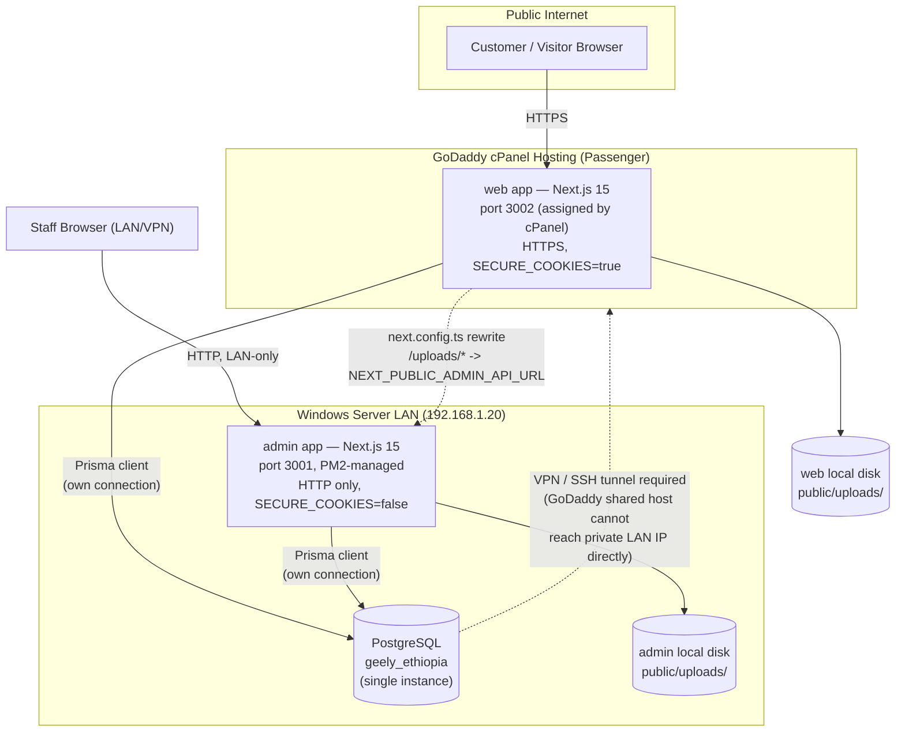
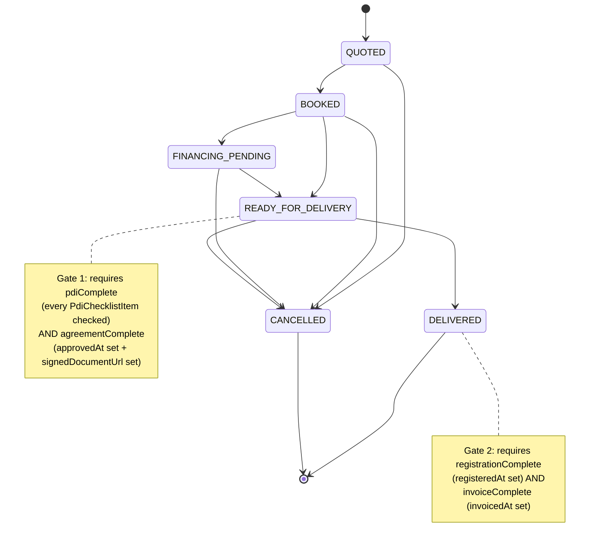
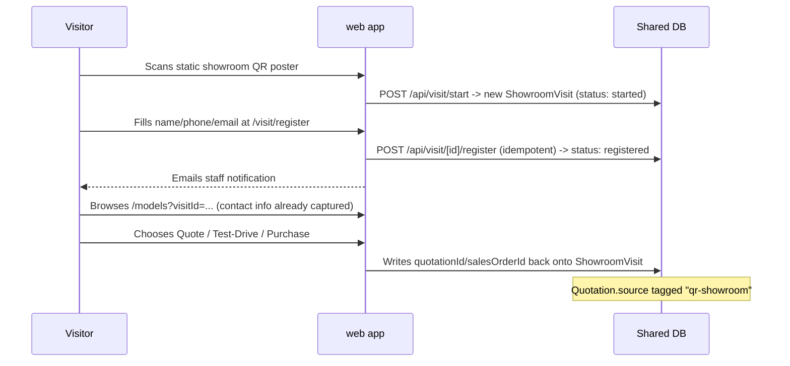
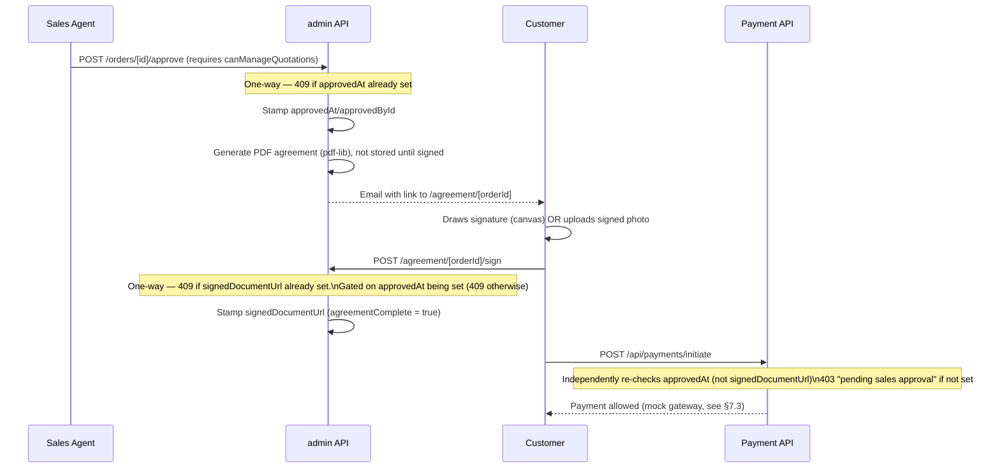
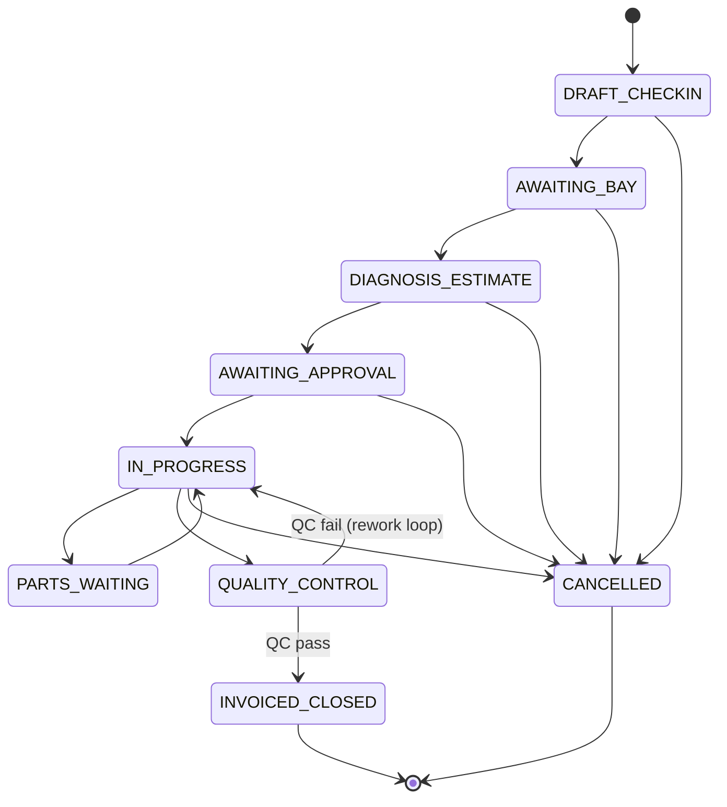
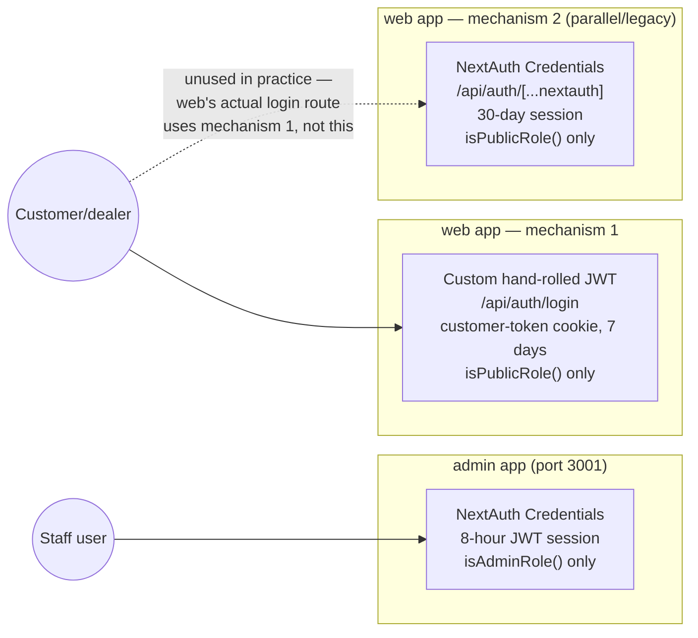
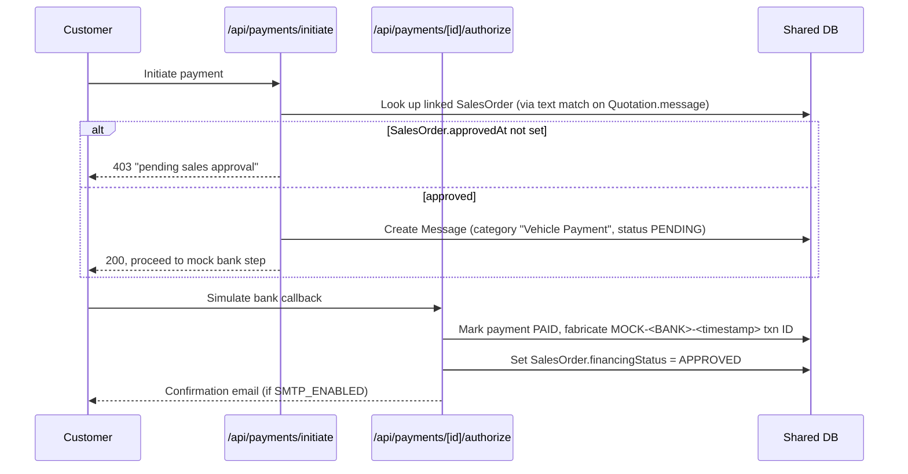

# Kerchanshe Geely Ethiopia — System Analysis

*A comprehensive technical and business analysis of the platform: architecture, tech stack, data model, business workflows, approval cycles, and data flow.*

---

## 1. Executive Summary

Kerchanshe Geely Ethiopia is an automotive dealership and workshop management platform built as **two independent Next.js applications sharing one PostgreSQL database**:

- **`web`** — the public-facing marketing/e-commerce site (vehicle catalog, configurator, financing/purchase flow, showroom QR walk-in, service check-in kiosk, customer accounts). Deployed on GoDaddy shared/cPanel hosting.
- **`admin`** — the internal back-office system (sales pipeline, workshop/service management, CMS content authoring, user/role administration, analytics). Deployed on a Windows Server LAN box via PM2, which also hosts the PostgreSQL instance.

There is **no separate backend/ERP service** — each app talks to the database directly through its own Prisma client, and business logic (order approval, workshop job-card state machines, commission calculation, etc.) lives in Next.js API routes in both apps. The single most important fact about this system: **it has no ERP and no live payment gateway**. Every "approval" is a manual staff action recorded as a timestamp/flag on a row, and payment is fully mocked pending a vendor decision (Chapa/Telebirr are named candidates, none integrated). This is by design and explicitly documented in the project's own backlog (`docs/SWMS-INTEGRATION-BACKLOG.md`): *"No ERP exists in this codebase — this repo is the operational system."*

The two apps are coupled by convention rather than infrastructure: they must share byte-identical auth secrets, a mirrored Prisma schema (synced one-directionally from `admin` to `web` via a script), and the same physical database — but they do **not** share a session, an uploads directory, or (in almost all cases) an API. Each app re-implements the logic it needs directly against the shared tables.

---

## 2. System Architecture

### 2.1 Tier diagram

**Key architectural facts:**

- No monorepo tooling (no workspaces, no Turborepo/Lerna/pnpm-workspace). `admin/` and `web/` are two fully independent `package.json`/`node_modules`/Next.js projects.
- No Docker, no Vercel — traditional long-running Node process hosting (PM2 on Windows for `admin`; Phusion Passenger via a custom `server.js` for `web` on cPanel).
- `admin` owns the PostgreSQL instance locally; `web`'s `DATABASE_URL` must reach it over VPN/SSH tunnel from GoDaddy's shared hosting — Postgres is never exposed to the public internet directly.
- Uploaded files are **not shared**: a file uploaded through `admin` lives only on the admin server's disk and is not reachable by `web`'s GoDaddy deployment except through the `/uploads/*` rewrite proxy in `web/next.config.ts`, which forwards image requests to admin's origin so they resolve same-origin without CORS.

### 2.2 Deployment topology

| | `admin` | `web` |
|---|---|---|
| Host | Windows Server, LAN IP `192.168.1.20` | GoDaddy shared/cPanel hosting, public domain |
| Port | 3001 | 3002 (cPanel-assigned via `process.env.PORT`) |
| Process manager | PM2 (`ecosystem.config.cjs`) or `npm start` | Phusion Passenger, custom `server.js` entry |
| TLS | None — HTTP only on LAN (`SECURE_COOKIES=false`) | HTTPS (`SECURE_COOKIES=true`) |
| Database | Hosts PostgreSQL locally | Connects to admin's DB via VPN/tunnel |
| Deployment package | `deploy/admin-deploy/` (via `scripts/package-deploy.ps1`, robocopy, excludes `node_modules`/`.next`/`.git`/`.env`) | `deploy/web-deploy/` (same script) |

**Critical coupling requirement:** `NEXTAUTH_SECRET` / `JWT_SECRET` must be **byte-for-byte identical** across both deployments — otherwise JWTs/sessions issued by one app would not validate against the shared `User` table logic the other app expects (in practice each app validates its own tokens, but the shared-secret convention is documented as required in both deploy docs).

### 2.3 Schema synchronization

`admin/prisma/schema.prisma` is the single source of truth (~60+ models). `web/prisma/schema.prisma` is a **byte-for-byte mirror**, kept in sync via `scripts/sync-web-prisma-schema.mjs` (a plain file copy) and `npm run sync:schema`. Convention: **edit the schema in `admin` only, then run the sync script** — never hand-edit `web`'s copy. Both apps share one `_prisma_migrations` history table in the same physical database.

### 2.4 CI/CD

- `.github/workflows/ci.yml` — on push/PR to main/master: (1) lint + typecheck both apps, (2) build both apps (dummy `DATABASE_URL` for `prisma generate`), (3) `npm audit --omit=dev --audit-level=critical` for both apps.
- `.github/workflows/lighthouse-ci.yml` — builds `web` and runs Lighthouse CI performance checks.
- **No CD/deploy automation** — deployment is a manual process using `scripts/package-deploy.ps1`.

---

## 3. Tech Stack

### 3.1 `admin` (`geely-ethiopia-admin`)

| Layer | Choice |
|---|---|
| Framework | Next.js 15.5.23 (App Router) |
| UI | React 19.0.0 / React DOM 19.0.0 |
| Language | TypeScript 5.7.2 |
| ORM / DB | Prisma ^5.22.0 + `@prisma/client`, PostgreSQL |
| Auth | NextAuth 4.24.15 (Credentials provider), `bcryptjs`, `jsonwebtoken` |
| Styling | Tailwind CSS 3.4.17 |
| State | Zustand, React Hook Form |
| PDF | `pdf-lib` (invoices, sales agreements) |
| QR | `qrcode` (showroom self-registration poster generation) |
| Email | `nodemailer` ^9 |
| Icons | `lucide-react` |
| Lint | ESLint 9 (`next lint`; `eslint.ignoreDuringBuilds: true` — noted tech debt) |
| Process mgmt | PM2 (`ecosystem.config.cjs`) |
| Port | 3001 |

### 3.2 `web` (`geely-ethiopia-web`)

Nearly identical dependency set to `admin` (Next 15.5.23, React 19, NextAuth 4.24.15, Prisma ^5.22.0, TypeScript 5.7.2, bcryptjs, jsonwebtoken, nodemailer, pdf-lib, react-hook-form, zustand), plus:

| Extra | Purpose |
|---|---|
| `framer-motion` | UI animation |
| Custom `server.js` | Phusion Passenger-compatible Node entry point, binds to `process.env.PORT` for cPanel hosting |
| `postinstall: prisma generate` | Ensures Prisma client is generated on deploy |

Port 3002. Security headers are notably more hardened in `web/next.config.ts` than admin's (full HSTS/CSP/X-Frame-Options/Referrer-Policy/COOP/Permissions-Policy set), since this is the public-internet-facing app.

### 3.3 Shared infrastructure

| | |
|---|---|
| Database | PostgreSQL, single instance, shared by both apps |
| Schema management | Prisma Migrate, single migration history, schema mirrored admin→web |
| Image hosting | Local disk (`public/uploads/`) per app — no S3/Cloudinary/Azure Blob |
| Email | `nodemailer` via SMTP, gated by `SMTP_ENABLED` env flag |
| CI | GitHub Actions (lint/typecheck/build/audit + Lighthouse) |
| Hosting | No containers — PM2 (admin, LAN) + cPanel Passenger (web, GoDaddy) |

---

## 4. Database & Domain Model

Single Prisma schema, ~60 models, organized by domain:

**Auth**
- `User` — all accounts (staff and customer/dealer), disambiguated by a `role` string field
- `RolePermissionOverride` — per-role permission-flag overrides on top of hardcoded defaults

**Vehicle Catalog**
- `VehicleBrand`, `VehicleCategory`, `Vehicle` (core catalog item — pricing, stock, SEO), `VehicleColor`, `VehicleAccessory`, `VehicleInterior`, `VehicleWheel`, `VehiclePackage` (trim levels), `VehicleShowcase`

**Sales / CRM**
- `TestDrive`, `ShowroomVisit`, `Quotation` (lead capture, source-tagged), `SalesOrder` (order lifecycle, financing status, PDI, registration/invoice/commission), `PdiChecklistItem`, `SalesOrderStatusHistory`, `Counter` (order numbering), `Dealer`

**Workshop / SWMS**
- `ServiceBooking`, `Technician`, `ServiceBay`, `JobCard` (core repair-order record), `JobCardStatusHistory`, `JobCardPart`, `WarrantyClaim`, `WarrantyClaimStatusHistory`, `Customer` (workshop identity, distinct from CRM), `CustomerVehicle` (VIN-level ownership), `CSISurveyResponse`

**Parts & Inventory**
- `SparePart`, `PartRequest`, `PartRequestItem`, `PartsPageContent`, `PartCategory`, `PartBrand`, `PartBenefit`

**CMS / Content**
- `Promotion`, `Review`, `NewsArticle`, `Message` (generic inbox/lead catch-all), `NewsletterSubscriber`, `Setting`, `HeroSection`, `MediaAsset`, `ElectricPage`/`ElectricSection`/`ElectricItem`/`ElectricMenuPage`, `ChargingStation`, `ServiceSection`/`ServiceItem`/`ServicePage`, `MegaMenuSection`/`MenuCategory`/`MenuItem` (**orphaned — API exists, no admin UI, nothing renders from them**), `FAQ`, `SiteNavItem`, `Redirect`

**Financing**
- `FinancingBank`, `FinancingProgram` (catalog data, not loan applications — see §5.4)

**Integration**
- `CRMSyncLog` (external CRM sync attempt log — no active external CRM found wired to it)

---

## 5. Business Logic & Workflows

### 5.1 Sales / Order Pipeline

**Core model chain:** `Quotation` → `SalesOrder` (1:1 via unique `quotationId`) → `PdiChecklistItem[]` + `SalesOrderStatusHistory[]`.

**Status enum:** `QUOTED → BOOKED → FINANCING_PENDING → READY_FOR_DELIVERY → DELIVERED`, with `CANCELLED` reachable from any non-terminal state.

The legal transitions are enforced **server-side** (not just disabled UI buttons) by a state machine (`admin/lib/sales/orderStateMachine.ts`), checked in `admin/app/api/admin/orders/[id]/status/route.ts`:

Reaching `DELIVERED` triggers a side effect in the same transaction: `deliveredAt` is stamped, and if a `salesAgentId` is on file, `commissionAmount = totalPrice * commissionRate / 100` is computed and `commissionStatus` is set to `EARNED`.

**Two entry paths into the pipeline:**

1. **Quote-first** — customer submits `/quote` → creates a `Quotation` (`new → contacted → in_progress → converted/closed`). A sales agent converts it to an order (`admin/app/api/admin/quotations/[id]/convert-to-order/route.ts`), which creates a `SalesOrder` at `BOOKED`, seeds the PDI checklist from a template, and sets `financingStatus: PENDING` if the quote flagged financing interest.
2. **Direct purchase** — customer fills the purchase form at `web/app/financing/apply/page.tsx` (vehicle, national ID, address, bank), posting to `web/app/api/public/purchases/route.ts`. This creates a `Message` record (category "Vehicle Purchase" — there is no dedicated `Purchase` model), then `linkPurchaseToSalesPipeline()` finds-or-creates a matching `Quotation` and `SalesOrder` so the direct purchase lands in the same admin pipeline as a converted quote. **The correlation key is a string** embedded in `Quotation.message` ("Purchase reference: GEO-...") — there is no foreign key tying the `Message`/purchase record to the `Quotation`/`SalesOrder`.

### 5.2 Showroom QR Walk-In Flow

**Model:** `ShowroomVisit` (`status`: `started → registered → sales|test-drive|purchase`), loosely linked (no FK) to `quotationId`/`salesOrderId`/`testDriveId`.

The QR code itself is static and stateless — every scan hits `/api/visit/start`, which mints a fresh `ShowroomVisit` row server-side. The `visitId` query param threads through the whole browsing session so the visitor never re-enters contact info. Admin visibility is a funnel view (`admin/components/admin/showroom-visits/ShowroomVisitsList.tsx`): Total → Registered → Quoted → Test Drives → Purchases, each visit linking to whatever record it produced.

### 5.3 Sales Agreement E-Sign & Approval Chain

This is the central approval cycle tying the whole pipeline together:

Staff can alternatively attach a signed scan directly via `OrderApprovalPanel.tsx` (`PATCH .../orders/[id]` with `signedDocumentUrl`), reusing the generic upload endpoint. Approval authority is a single permission flag (`canManageQuotations`) — there is **no manager-over-agent hierarchy**; whoever holds the flag can approve.

### 5.4 Financing

**There is no loan-application or underwriting workflow.** A schema comment states this explicitly: *"the system records financing status; it does not underwrite financing."*

- `admin/app/admin/financing/page.tsx` is a **catalog/CMS management page**: admins configure `FinancingBank` partners and `FinancingProgram` offers (interest rate, down payment %, tenure, processing fee, insurance %, CTA toggles, `DRAFT/PUBLISHED/ARCHIVED` status).
- `web/app/financing/apply/page.tsx` is actually the **direct vehicle purchase form** described in §5.1 path 2 — despite its URL, it is not a loan application. Submitting it enters the sales pipeline directly.
- The only "financing approval" in the data model is `SalesOrder.financingStatus` (`NOT_APPLICABLE | PENDING | APPROVED | DECLINED`), manually edited by staff via a dropdown. **It has no bearing on the order state-machine gates** — it is informational only. (It is, however, set to `APPROVED` automatically as a side effect of a mock payment being "authorized" — see §7.3.)

### 5.5 Invoicing, Commission, and Registration Tracking

All three live as plain fields directly on `SalesOrder` — deliberately not normalized into separate AR/commission-ledger tables (code comments cite the lack of an ERP):

| Concern | Fields | Behavior |
|---|---|---|
| Registration | `registrationNumber`, `registeredAt`, `registeredById` | Correctable field edit (not a one-way gate), set via `OrderFulfillmentPanel.tsx` |
| Invoice | `invoiceNo` (sequential), `invoiceAmount`, `invoicedAt`, `invoicedById` | One-way generation via `POST .../orders/[id]/invoice` (409 if already invoiced); PDF rendered on demand and emailed |
| Commission | `salesAgentId` (free text, no user picker), `commissionRate`, `commissionAmount`, `commissionStatus` | `NOT_APPLICABLE → PENDING → EARNED → PAID`. Assigning an agent sets `PENDING`; `EARNED` + amount auto-stamped the instant the order reaches `DELIVERED`; `PAID` is a separate always-manual step (`POST .../orders/[id]/commission/pay`, 409 unless status is `EARNED`) — modeling that accounting pays agents on its own schedule |

### 5.6 Vehicle Inventory Management

- `Vehicle` carries pricing (`basePrice`, `discountAmount`, `discountType`, `taxRate` default 15%, `finalPrice`, `hidePrice`) and inventory (`stock`, `sku`, `reorderPoint`, `warehouse`, `location`) directly on the same row.
- `finalPrice = (basePrice - discountAmount) + taxAmount` is computed **server-side** on save (`admin/app/api/admin/vehicles/route.ts`).
- Lifecycle: `draft → published → archived` (an "Auto-publish" checkbox in the form sets `published` directly).
- `InventoryManager.tsx` (stock, reservedStock, lowStockThreshold, warehouseLocation, incoming stock/expected date) is **UI-only bookkeeping** — booking a `SalesOrder` does **not** decrement `Vehicle.stock`. There is no reservation logic tying inventory counts to actual orders.

### 5.7 Workshop / SWMS (Service Management)

A separate pipeline from vehicle sales, keyed on `JobCard`, with its own state machine (`admin/lib/workshop/jobCardStateMachine.ts`):

**Guards enforced in the state machine:**
- Cannot leave `DRAFT_CHECKIN` without `complaintText` captured (supports kiosk self-check-in creating a bare draft).
- Cannot reach `IN_PROGRESS` (from most states) without `customerApprovedAt` set, **unless** `isWarrantyOrGoodwill`.
- Cannot reach `INVOICED_CLOSED` unless `qcPassed === true`.
- Jobs open more than 3 business days are flagged overdue (`isOverdue()`).

`WorkshopDashboard.tsx` is a live floor-management view (auto-refresh every 30s): bay occupancy board (`ServiceBay.status: FREE/OCCUPIED/OUT_OF_SERVICE`), KPIs (bays busy, jobs today, avg turnaround, pending-approval count, overdue count, parts-below-reorder count), and an open-job-cards table.

Related models: `Technician` (skill level), `JobCardPart` (parts issued against a job — `REQUESTED/ISSUED/BACKORDERED/CANCELLED`, with reserved-quantity tracking against `SparePart`), and `WarrantyClaim` with its **own** approval cycle: `DRAFTED → SUBMITTED → UNDER_REVIEW → APPROVED/REJECTED → REIMBURSED`, approvable only by `manager`/`super_admin`/`admin`/`service_manager` (a `service_advisor` can draft/submit but not approve).

### 5.8 Roles & Permissions

**Roles:** `super_admin, admin, manager, sales, service, marketing, service_advisor, service_manager` (admin-panel roles) vs. `customer, dealer` (public-portal-only, zero admin permissions).

- **Static defaults** — `ROLE_PERMISSIONS` in `admin/lib/auth/types.ts` hardcodes ~30 boolean permission flags per role.
- **Editable overrides** — `RolePermissionOverride` (one row per `role` + `permissionKey`) lets an admin adjust a role's effective permissions at runtime. `getEffectivePermissions()` merges defaults with overrides, cached 30 seconds and invalidated on write. `super_admin` is hardcoded as **never overridable**, guaranteeing an always-available escape hatch.
- **Two separate login flows**, described fully in §7.2.

---

## 6. Approval Cycles — Consolidated View

| Gate | Who clears it | What it stamps | What it unlocks |
|---|---|---|---|
| Sales order approval | Staff with `canManageQuotations` | `SalesOrder.approvedAt`, `approvedById` | Generates PDF agreement; unlocks customer e-sign and (independently) payment initiation |
| Agreement e-sign | Customer (self-service, no login) or staff attaching a scan | `SalesOrder.signedDocumentUrl` | Combined with `approvedAt`, satisfies `agreementComplete` for the `READY_FOR_DELIVERY` transition |
| PDI checklist | Staff (per-item checkbox) | `PdiChecklistItem.isChecked` (all items) | Satisfies `pdiComplete` for the `READY_FOR_DELIVERY` transition |
| Vehicle registration | Staff | `SalesOrder.registeredAt`, `registrationNumber` | Satisfies half of the gate for `DELIVERED` |
| Invoice generation | Staff (one-way) | `SalesOrder.invoicedAt`, `invoiceNo` | Satisfies the other half of the gate for `DELIVERED` |
| Commission payout | Staff/accounting (one-way, requires `EARNED`) | `SalesOrder.commissionStatus = PAID` | Terminal step; no downstream unlock |
| Payment initiation | System (automatic check) | N/A (reads `approvedAt`) | Refuses to create a payment record unless order is already approved |
| JobCard customer approval | Customer (via staff-relayed estimate) or auto-bypassed for warranty/goodwill | `JobCard.customerApprovedAt` | Required to move past estimate stage into `IN_PROGRESS` |
| JobCard QC pass | Technician/service manager | `JobCard.qcPassed = true` | Required to reach `INVOICED_CLOSED`; failure loops back to `IN_PROGRESS` |
| Warranty claim approval | `manager`/`super_admin`/`admin`/`service_manager` only | `WarrantyClaim.status = APPROVED` (or `REJECTED`) | Enables `REIMBURSED` step |

**Notable pattern:** every approval in this system is a **manual staff (or self-service customer) action that flips a flag/timestamp on an existing row** — there is no automated underwriting, no external system posting an approval, and no multi-level sign-off chain (a single permission flag, not a hierarchy, gates each approval).

---

## 7. Data Flow & Integration Layer

### 7.1 API surface (grouped, ~220 routes total across both apps)

**`web/app/api/**` (~80 routes):**
- Auth: `auth/login`, `auth/register`, `auth/logout`, `auth/[...nextauth]`, `auth/forgot-password`, `auth/reset-password`
- Vehicles/catalog: `vehicles/*`, `public/vehicles*`, `public/categories*`, `public/brands`
- Orders/purchases/financing: `public/purchases/*`, `public/financing-*`, `quotations`, `public/quotations`, `agreement/[orderId]/*`
- Payments: `payments/initiate`, `payments/[paymentId]/*`, `public/payments/direct`
- CRM/leads/contact: `crm/lead`, `messages`, `admin/contact` (see §7.4), `newsletter/subscribe`
- Test drives/service/workshop-adjacent: `test-drives`, `service-bookings`, `service-check-in`, `service-check-in/lookup`, `csi-survey/[jobCardId]`, `visit/*`
- CMS content (public read, mirrors admin tables): `public/hero`, `public/news`, `public/faq`, `public/testimonials`, `public/promotions`, `public/electric/**`, `public/services/**`, `public/site-nav`, etc.
- Misc: `search`, `reviews`, `parts`, `upload/image`, `analytics/vitals`, `redirects/list`, `redirects/hit`

**`admin/app/api/**` (~140 routes):**
- Auth: `auth/[...nextauth]`, `forgot-password`, `reset-password`
- Vehicle catalog & configurator taxonomy: `admin/vehicles*`, `vehicle-colors`, `vehicle-packages`, `vehicle-interiors`, `vehicle-accessories`, `vehicle-wheels`, `brands`, `categories`
- Sales pipeline: `admin/quotations/[id]/*`, `admin/orders/[id]/*` (approve, pdi, status, agreement, invoice, commission/pay), `admin/customers*`, `admin/purchases`, `admin/test-drives*`, `admin/dealers*`
- Workshop/SWMS: `admin/workshop/{technicians,bays,board,dashboard,bi-dashboard,vehicle-lookup,job-cards/**,parts/reorder-alerts,warranty-claims/**}`
- Spare parts/merchandising: `admin/spare-parts`, `parts/{benefits,brands,categories,content}`
- CMS admin authoring: `admin/{hero,news,faq,showcase,promotions,reviews,site-nav,mega-menu,services/**,electric/**,charging-stations}`
- Analytics/dashboard: `admin/analytics`, `admin/dashboard/stats`, `workshop/bi-dashboard`
- Users/permissions: `admin/users`, `admin/users/[id]`, `admin/role-permissions`
- Public-facing (admin-hosted, unauthenticated): `public/{dealers,vehicles,contact-information,health,quote,test-drive}`

### 7.2 Authentication & session flow

**There is no shared session/cookie between `web` and `admin`.** They are independent NextAuth/JWT deployments that happen to read/write the same `User` table in the shared database. **Three distinct mechanisms coexist:**

- **Admin:** NextAuth (`admin/lib/auth/config.ts`), Credentials provider, JWT strategy, 8-hour session. `authorize()` rejects `customer`/`dealer` roles. Session callback attaches `role`, `dealerId`, and live-computed `permissions`.
- **Web, mechanism 1 (actually used):** `web/app/api/auth/login/route.ts` hand-signs a JWT with `jsonwebtoken`, sets a `customer-token` httpOnly cookie. Rejects staff roles with a 403 pointing them to `/admin/login`.
- **Web, mechanism 2 (parallel/legacy):** A second NextAuth instance also exists in `web` (`web/app/api/auth/[...nextauth]/route.ts`), also credentials-based against the same `User` table. `web`'s real login route does not delegate to it — it appears to be a leftover/duplicate path (a related hook, `useAdminAuth.ts`, is self-referenced only and misleadingly named).

**Enforcement:** `admin/lib/auth/api.ts`'s `requireAdminApiSession()` is the single server-side enforcement point for every `/api/admin/*` route (401 if role isn't an admin role), followed by fine-grained checks against specific permission flags (e.g. `canManageQuotations`). `admin/middleware.ts` does **not** perform auth gating itself — it only handles CORS for `/uploads/*`; all enforcement happens at the page/API level.

**Known drift:** `admin/lib/auth/types.ts` and `web/lib/auth/types.ts` are hand-duplicated (no shared package) and have diverged — admin's copy has grown workshop-specific roles/permissions (`service_advisor`, `service_manager`, `canViewJobCards`, `canManagePartsIssue`, `canApproveWarrantyClaims`) that web's copy lacks.

### 7.3 Payment flow (mock)

**No real payment gateway is integrated.** `docs/SWMS-INTEGRATION-BACKLOG.md` states this explicitly: *"a real payment gateway (Chapa/Telebirr/etc. — still mock-only, no vendor chosen)."*

Note the fragile correlation: since `Message` has no foreign key to `Quotation`/`SalesOrder`, the payment→order link is resolved by text-matching a "Purchase reference: GEO-..." string embedded in `Quotation.message`.

### 7.4 Contact/lead capture flow

- `web/app/contact/page.tsx` posts to `POST /api/crm/lead`, which writes a `Message` row directly (or a `TestDrive` row for test-drive-type leads) via Prisma against the shared DB, then emails a notification.
- `web/app/api/admin/contact/route.ts` is a confusingly-named, likely-**dead/vestigial** route: it proxies to the admin app's *page* URL (not its API) for contact info — the actual contact page instead calls `web`'s own `/api/public/contact-information`, which reads the `Setting` table directly. This looks like a leftover from an earlier architecture where `web` had no direct DB access.
- Surfacing in admin: `admin/app/admin/analytics/page.tsx` shows an aggregate `unreadMessages` count and links to the raw admin Messages inbox. There is **no dedicated "Leads" model or leads-specific analytics** — all generic contact-form submissions land in the catch-all `Message` table; structured, pipeline-tracked lead data instead lives in `Quotation`/`TestDrive`/`SalesOrder`, which analytics does report on properly (`totalQuotations`, `salesByCategory`, `topVehicles`).

### 7.5 Cross-app data flow: shared DB, not an API bridge

Both apps run business logic **independently against the shared tables** rather than calling each other's APIs. This is called out repeatedly in the project's own backlog doc as a deliberate pattern: the kiosk check-in, the CSI survey page, and the purchase→order linkage in `web` are all **parallel, independent Prisma implementations**, not calls into admin's API — "there's no cross-app API between the two deployments today." The one confirmed exception is the likely-dead `web/app/api/admin/contact/route.ts` proxy described above.

### 7.6 External integrations

| Integration | Status |
|---|---|
| Email (SMTP via `nodemailer`) | **Real** — lead notifications, payment confirmations, order/job-card status emails, agreement/invoice PDF attachments. Gated by `SMTP_ENABLED`. |
| SMS | **Not implemented** — structured placeholder functions return an explicit "not configured" result. Blocked on choosing a provider (Twilio / Africa's Talking / Meta Cloud API). |
| WhatsApp | **Not implemented** — same placeholder pattern; `admin/lib/env.ts` has stub config (`token`/`phoneId`) not wired to any live sending code. |
| File storage | Local disk only, per-app `public/uploads/` — no S3/Cloudinary/Azure Blob. Sanitized against path traversal, category-allowlisted, SVG rejected. |
| PDF generation | `pdf-lib` (pure JS, no headless browser) — sales agreements, invoices, e-sign stamping. Duplicated (not shared) between `admin` and `web`. |
| Government incentive data | **Not a live API** — served as CMS-authored content from the `ElectricPage` table. |
| Payment gateway | **None** — fully mocked (§7.3); Chapa/Telebirr named as un-chosen candidates. |
| ERP | **None** — explicitly and repeatedly noted as non-existent; this system is the operational system of record for VIN-level stock, invoicing, and warranty/parts allocation. |

---

## 8. Known Gaps, Tech Debt & Deferred Work

**Fixed via ADR-001 hardening pass** (documented in `docs/adr/ADR-001-hardening.md`, kept here for context on what the *pre-hardening* state was): 21+ previously-unauthenticated admin API routes, path traversal in image delete, arbitrary file uploads, SSRF via an unrestricted `images.remotePatterns: "**"`, a PII leak in a public vehicle endpoint, duplicated Prisma clients, and misuse of `$disconnect()`.

**Still open / explicitly deferred** (per `docs/SWMS-INTEGRATION-BACKLOG.md`):
- Real-time OEM/ERP stock allocation
- Real SMS/WhatsApp delivery (provider not chosen)
- Multi-branch/multi-location support
- Offline-tolerant technician tablets
- Full ERP-posted invoicing/accounts-receivable
- A real payment gateway (Chapa/Telebirr candidates, no integration)
- Next.js 16 upgrade
- Migrating `next lint` to the ESLint CLI directly (`eslint.ignoreDuringBuilds` currently `true`)

**Structural drift noted during this analysis:**
- `web`'s auth type definitions have fallen behind `admin`'s (missing workshop-specific roles/permissions) — a live divergence between two hand-duplicated files with no shared package.
- `web` runs two parallel auth systems (custom JWT + a NextAuth instance) simultaneously; the NextAuth one appears unused by the actual login flow.
- `MegaMenuSection` / `MenuCategory` / `MenuItem` models and their admin API exist with no UI ever built — orphaned code.
- `web/app/api/admin/contact/route.ts` appears to be dead code from an earlier pre-shared-DB architecture.
- `Vehicle.stock` is not decremented by the sales pipeline — inventory counts and actual order bookings can drift.
- The purchase↔order correlation relies on string matching inside a text field (`Quotation.message`) rather than a foreign key, which is fragile.

---

## 9. Appendix — Key File Reference Map

| Concern | File(s) |
|---|---|
| Sales order state machine | `admin/lib/sales/orderStateMachine.ts` |
| Job card state machine | `admin/lib/workshop/jobCardStateMachine.ts` |
| Admin auth config | `admin/lib/auth/config.ts`, `admin/lib/auth/types.ts`, `admin/lib/auth/rolePermissions.ts`, `admin/lib/auth/api.ts` |
| Web auth (custom JWT) | `web/app/api/auth/login/route.ts`, `web/app/api/auth/register/route.ts` |
| Web auth (NextAuth, parallel) | `web/app/api/auth/[...nextauth]/route.ts`, `web/lib/auth/config.ts` |
| Prisma schema (source of truth) | `admin/prisma/schema.prisma` |
| Prisma schema (mirror) | `web/prisma/schema.prisma` |
| Schema sync script | `scripts/sync-web-prisma-schema.mjs` |
| Deployment packaging | `scripts/package-deploy.ps1` |
| Deploy docs | `docs/DEPLOY-ADMIN-LAN.md`, `docs/DEPLOY-WEB-GODADDY.md` |
| Architecture Decision Records | `docs/adr/ADR-001-hardening.md` (also covers ADR-002 standalone deployment) |
| Business/workflow backlog | `docs/SWMS-INTEGRATION-BACKLOG.md` (17-phase build log), `docs/ADMIN-IA-BACKLOG.md` |
| Sales agreement/invoice PDF generation | `admin/lib/sales/salesAgreementPdf.ts`, `admin/lib/sales/salesInvoicePdf.ts`, `web/lib/sales/salesAgreementPdf.ts` |
| Payment routes | `web/app/api/payments/initiate/route.ts`, `web/app/api/payments/[paymentId]/authorize/route.ts` |
| Showroom QR flow | `web/app/api/visit/start/route.ts`, `web/app/api/visit/[id]/register/route.ts`, `admin/components/admin/showroom-visits/ShowroomVisitsList.tsx` |
| Workshop dashboard | `admin/components/admin/workshop/WorkshopDashboard.tsx`, `admin/app/api/admin/workshop/dashboard/route.ts` |
