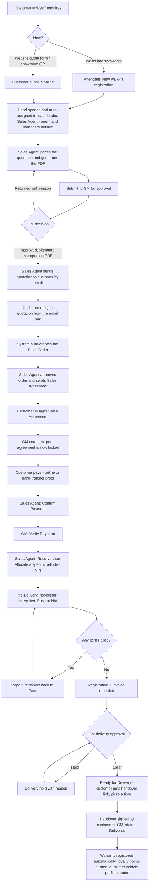
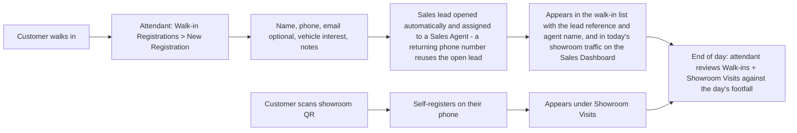
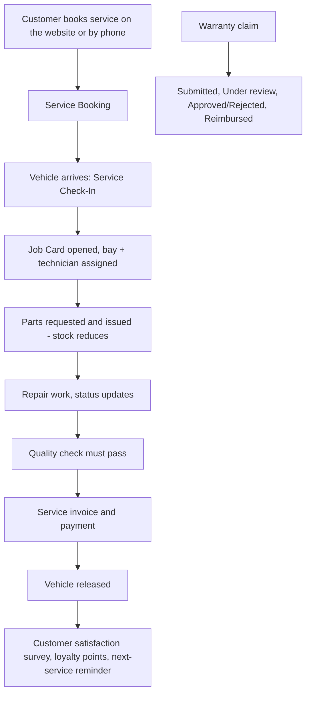

# Geely Ethiopia — Sales & After-Sales Process Flow

Kerchanshe Trading PLC · Go-live 1 October 2026 · Version 1.0 (29 Sep 2026)

This is the end-to-end journey a customer takes through the system, who does
each step, and what must be true before the next step unlocks. Use it with the
[User Manual](USER-MANUAL.md) (how to click through each step) and the
[UAT Test Script](UAT-TEST-SCRIPT-AND-SIGN-OFF.md) (how we prove it works).

## 1. The people

| Who | System role | Does what |
|---|---|---|
| **Customer Attendant** (attendance team) | Customer Attendant | Registers walk-in customers at the showroom (which opens a sales lead automatically), checks the day's visitors and customers |
| **Sales Agent** | Sales | Owns the customer after hand-over: prices the quotation, sends it, sends the agreement, records payment, allocates the car, completes the PDI |
| **General Manager** | GM Geely | Approves quotations, countersigns agreements, verifies payment, approves delivery; watches the dashboards |
| **Customer** | (no login) | Receives emails; e-signs the quotation and agreement from a link; pays; books test drives / service on the website |

## 2. The main flow (customer → car delivered)

### Gates: what blocks the next step

| To reach… | All of these must be true |
|---|---|
| **Sales Agreement can be sent** | Order approved |
| **Payment can be confirmed** | Agreement signed by customer **and** countersigned by GM |
| **Vehicle can be Allocated (VIN locked)** | Payment verified by GM |
| **Ready for Delivery** | PDI 100% Pass/N/A (no Failed items) · agreement countersigned · payment confirmed **and** verified · vehicle Allocated · registration and invoice recorded · GM has not put a delivery hold |
| **Delivered** | Ready for Delivery + handover signatures |

If a button is missing or greyed out, the order screen shows a message naming
the missing step — that message is the answer, not a fault.

### What is locked once signed

- A quotation can't be edited after the GM has approved it or the customer has signed it.
- Agreement fields (price, colour, payment schedule, customer details…) can't be edited after GM countersign. A correction needs a new version.

## 3. Showroom attendance flow (daily)

## 4. After-sales maintenance flow

## 5. Dashboards (who sees what)

| Dashboard | Where | Sales Agent | Attendant | GM |
|---|---|---|---|---|
| Executive Overview | Dashboard > Executive Overview | Light view | Light view | **Full** |
| Sales Dashboard — target pace, today's quotes/orders/payments, showroom traffic | Dashboard > Sales Dashboard | ✔ | ✔ | ✔ |
| CRM Dashboard | Dashboard > CRM Dashboard | – | – | ✔ |
| Workshop BI (after-sales / maintenance) | Dashboard > Workshop BI | – | – | ✔ |
| Sales Targets | Dashboard > Sales Targets | – | – | ✔ |

## 6. Notifications customers and staff receive

Quotation submitted (customer) · agent assigned (agent) · approval needed (GM) ·
quotation approved (agent) · quotation sent (customer, with *Review & Sign*) ·
order created · agreement sent (*Review & Sign*) · agreement signed (agent, GM) ·
payment received · PDI complete · ready for delivery (*Schedule / Confirm Handover*) ·
delivered · warranty registered. Every customer email carries a *Check Status* link.

## 7. Known limits at launch (by design, not faults)

- **Online payment** is a simulated "pay now" plus bank-transfer proof upload; the money is confirmed by staff (Confirm Payment → Verify Payment). There is no live payment-gateway connection yet.
- **Vehicle inventory** is a stock counter per model; the VIN is typed in when allocating. There is no live feed from an ERP/OEM stock system.
